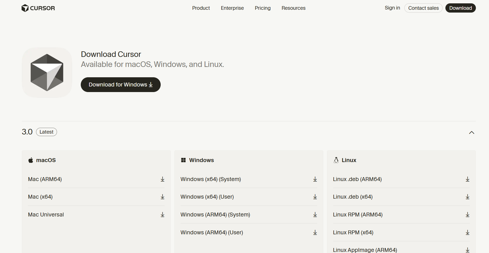
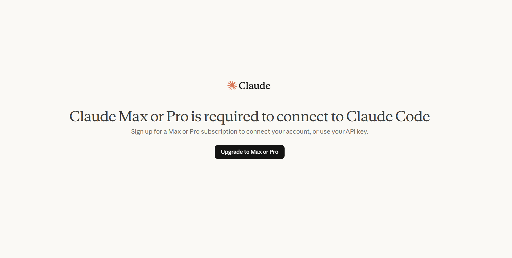

# Cursor IDE Setup with Claude and Codex

> Documenting the setup of Cursor IDE with Claude Code and Codex, including issues and solutions.

## Overview

This project focuses on completing the setup successfully while solving issues encountered during the process.


## Tools Used

- [Cursor IDE](https://cursor.com/) — AI-native code editor
- Claude Code Extension — AI coding assistant inside Cursor
- Codex Extension — Alternative AI coding extension
- Git + GitHub — Version control and remote repository


## Setup Walkthrough

### 1. Installing Cursor IDE


Downloaded the installer from [cursor.com](https://cursor.com/) and followed the standard installation steps. No issues here — Cursor launched cleanly on the first try.

### 2. Creating a GitHub Repository

Created a new public repository on GitHub with a name and description, without initializing it with a README file.

### 3. Connecting the Repo to Cursor

Opened the repository inside Cursor and tried to clone it locally — which immediately failed. See below for what happened.


### 4. Setting Up Claude Code

Searched for the Claude Code extension inside Cursor's extensions panel and installed it. Hit a wall immediately: logging in required a **Pro subscription**, which I didn't have at the time.

Rather than treating this as a blocker, I documented the limitation and moved on. Claude Code is on the list to explore once I have access.

### 5. Setting Up Codex

Installed the Codex extension through the same extensions panel, logged in without issues, and had it up and running as the primary AI assistant for this setup.


---

## Issues and How I Fixed Them

### 1. Git wasn't installed


**What happened:**  
When I tried to clone the repository using Cursor IDE, the "clone repo" button did not respond. There was no error message or feedback, which made it unclear what the issue was.

**Why it happened:**  
Cursor relies on Git installed on the local system to perform repository operations. Since Git was not installed, the action could not be executed.

**How I identified it:**  
After checking basic setup steps and searching for similar issues, I found that Git is a required dependency for cloning repositories.

**What I did:**  
- Installed Git from [git-scm.com](https://git-scm.com/)  
- Verified the installation using `git --version` in the terminal  
- Retried the clone operation in Cursor  

**Outcome:**  
The repository was successfully cloned, and the issue was resolved.

### 2. Claude Code login restriction


**What happened:** After installing the extension, I couldn't log in — it required a paid subscription.

**Why it happened:** This is just how the tool is priced. Not a bug, not a misconfiguration.

**What I did:** Noted it, switched to Codex for the rest of the setup, and kept moving. Sometimes the right move is just to work around a limitation rather than get stuck on it.


### 6. Creating and Adding README.md

Created the README.md file manually inside Cursor IDE.

**How I did it:**  
- Opened the Explorer panel in Cursor (left sidebar)  
- Right-clicked on the project root folder and selected **New File**  
- Named the file `README.md` and created it  
- Added the documentation using Markdown syntax  

---

### 7. Pushing README.md to GitHub

After creating the file locally, I pushed it to the GitHub repository.

**Steps I followed:**
- Opened the integrated terminal in Cursor  
- Ran the following commands:

```bash
git add README.md
git commit -m "Add README.md"
git push -u origin main
```

## What I Took Away From This

This setup wasn’t very complex technically, but it made me realize how important the basics are.

- Most issues happened because something small was missing (like Git), not because the tool was broken  
- It’s better to understand why something failed instead of just trying random fixes  
- Writing things down while working helped me stay clear and actually understand each step  

## Author

**Aravind Mudraveni**  
Aspiring AI Growth Marketer | Digital Marketing & Tech Enthusiast
